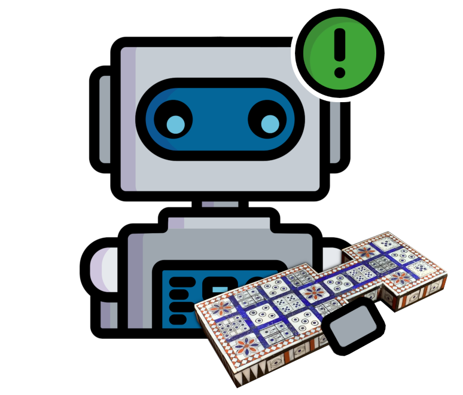

# 🎲 The Royal Game of Ur Analysis

This repository is dedicated to the technical analysis of
[The Royal Game of Ur](https://en.wikipedia.org/wiki/Royal_Game_of_Ur).
We use AI agents over a wide range of skill levels to help us answer
questions about strategy in The Royal Game of Ur, including questions such as:

- 🍀 How much of the game is luck?

- 🐇 Does playing first give you an advantage?

If you find these questions interesting like we do, or if you just like cool AI designed
to solve probability-heavy games, then you are in the right place!

<a href="https://github.com/Sothatsit/RoyalUrAnalysis">
  &nbsp;&nbsp;&nbsp;&nbsp;
  
</a>

**Introduction to the game:** The Royal Game of Ur is an ancient Sumerian board game discovered by Sir Leonard Woolley in a
tomb in ancient Ur in 1922. The game dates back to **over 4000 years ago**, and is considered
by many to be the oldest board game in the world!

You can learn the rules of the game at https://royalur.net/rules, or play the game over at https://royalur.net!

### Join the community!
If you're interested in The Royal Game of Ur, we have a [Discord](https://discord.gg/Ea49VVru5N)
and a [Reddit](https://www.reddit.com/r/GameofUr/) that you might want to check out! These are
both good places to talk about the game, its strategies, and see cool board recreations that
people have made! The Discord is also a great place to find strong opponents to challenge!
(Other than our own AI's of course!)

  
  
  

# 💡 Our current Insights
If you'd like to learn more about questions such as:

- 🍀 How much of the game is luck?

- 🐇 Does playing first give you an advantage?

Then check out our list of insights that we have found out about
The Royal Game of Ur in [docs/Insights.md](/docs/Insights.md)!

# 🧐 Analyse your own positions
If you'd like to analyse your own positions, just open the RoyalUrAnalysis.jar
file, and it will open a window where you can input a game position. You can
then click _Analyse_ and it will analyse the position using the same AI used for
the royalur.net Panda difficulty! In the future, we plan to add support for
analysing the positions using more AI's as well.

In the window simply click any details you want to change about the position,
and they will toggle between their possible states.

# 🤖 Meet the Agents
We currently have a small set of agents designed to play The Royal Game of Ur,
and each takes a slightly different approach to picking their moves!

| Agent | Description |
| ----- | ----------- |
| [Random](/docs/Agents.md#-the-random-agent-)         | Picks a random move, every time! |
| [First-Move](/docs/Agents.md#-the-first-move-agent-) | Picks the least advanced piece to move. |
| [Last-Move](/docs/Agents.md#-the-last-move-agent-)   | Picks the most advanced piece to move. |
| [Greedy](/docs/Agents.md#-the-greedy-agent-)         | Prioritises taking pieces, and moving onto rosettes. |
| [Expectimax](/docs/Agents.md#-the-expectimax-agent-) | Does a statistical analysis to determine the best move. |
| [Panda](/docs/Agents.md#-the-panda-agent-)           | A cheaper variant of expectimax that skips checking some rolls. |

If you'd like to delve deeper into each agent, how they function, and more statistics
about each of them, then check out [docs/Agents.md](/docs/Agents.md) for more information!

# 🥊 Challenge the AI's yourself
If you'd like to challenge the [Panda Agent](/docs/Agents.md#-the-panda-agent-),
the website [RoyalUr.net](https://royalur.net) has the _Extreme_ difficulty,
which uses the RoyalUrAnalysis Panda Agent under the hood!

# 🔨 Project Installation
RoyalUrAnalysis requires the Java JDK and [Apache Maven](https://maven.apache.org/download.cgi) to build. Java version 17 is known to be supported, although earlier versions may also work. Maven can be easily installed on Windows using chocolatey: `choco install maven`.

Once the dependencies are installed, run `mvn install` at the root of the project. This will build the CLI into `target/CLI.jar`. RoyalUrAnalysis may then be ran using `java -jar target/CLI.jar`.

# 🚧 Add our AI agents to your website
RoyalUrAnalysis has a WASM build target and JavaScript API that allows you
to use its AI's from the web! Check out the documentation for RoyalUrAnalysis
on the web in [WebSupport.md](/docs/WebSupport.md).

# 📝 License
This program is free software: you can redistribute it and/or modify
it under the terms of the GNU General Public License as published by
the Free Software Foundation, either version 3 of the License, or
(at your option) any later version.

This program is distributed in the hope that it will be useful,
but WITHOUT ANY WARRANTY; without even the implied warranty of
MERCHANTABILITY or FITNESS FOR A PARTICULAR PURPOSE.  See the
GNU General Public License for more details.

You should have received a copy of the GNU General Public License
along with this program.  If not, see <https://www.gnu.org/licenses/>.
